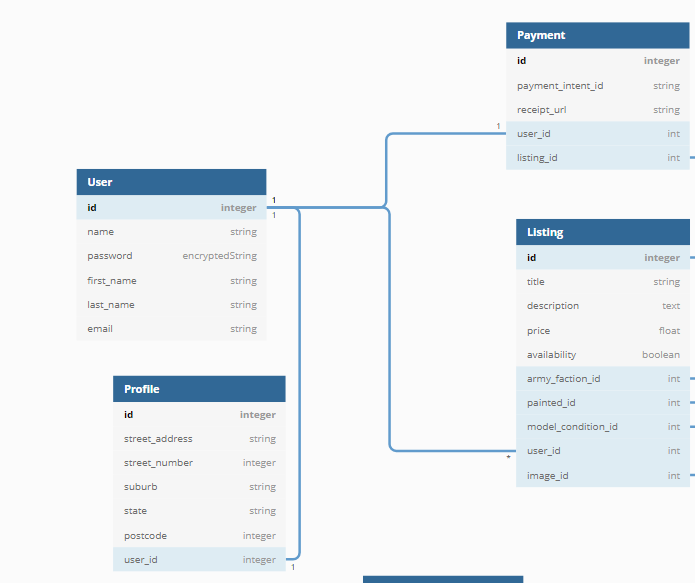

# WarHammer Marketplace 

# How to set up 

1. Clone github repo
``` 
git clone git@github.com:jkirky82/Warhammer-store.git
```
2. Check to see if files are set up correctly 
```
yarn 
```
3. Install gems 
```
bundle install
```
4. Create, migrate and seed database
```
rails db:create
```
```
rails db:migrate
```
```
rails db:seed
```
5. Add needed Api keys 

6. Run server 
```
rails s
```


# Deployed App
https://warhammerstore.herokuapp.com/

# Github Repo
https://github.com/jkirky82/Warhammer-store


# What is Warhammer 40k 
Warhammer 40k is a miniature  tabletop war game made by GamesWorkshop. It involves choosing an army out of many races/factions, purchasing plastic miniatures, building, painting and then with a set of core rules and race/faction specific rules, play against other peoples armies. When Building an army it is broken down into combat rolls: HQ, troops, elites, fast attack, heavy support and transport, these each have their own set of units that can go in them, they could be 1 single model, or a unit of 5 or more models. The hobby is super fun onces invested into, but is a very expensive hobby which limits the amount of people wanting to join.


# Problems with Warhammer 40k

The problem with Warhammer 40k is that it is a very expensive hobby, one of the most expensive hobby i've ever got myself into. When building army you buy the models based on the unit, if you are buying one that is in the HQ combat roll, that can cost you around $60 for 1 model and in the troop combat roll these boxes have around 10 models in them for $100, this will come unbuilt and unpainted. Now if for a full army this can cost around $1k to $2k depending on how you build it, this isn't including paint, mats to play on and terrain to use. This makes the hobby very expensive, it is also very time consuming to build and paint every model.

With this in mind here are some of the problems the hobby faces:
  - There are really no good second hand model websites besides ebay which is hard to find specific models.
  - Some people don't have time to build and paint their own models.
  - locally their aren't any good second hand Warhammer shops.

This new website of a dedicated two way marketplace for just Warhammer models, this should help long time and new players find cheaper models, these can be painted if thats what they would like or even unpainted models but just at a cheaper price.

# Why do these Need to be Solved

The game needs players for the game to stay alive, and a lot of people don't want to spend the high amounts of money and time it takes to just make 1 army. This website will help people get into the hobby with cheaper and painted or unpainted models in a more local area.

# Application Breakdown

- ## Purpose

The purpose is to make an online shop that allows users to sell or buy second hand Warhammer models for a cheaper price for a more local market rather then it being an international market.

- ## Functionality / features

First when using the application if this is your first time using this application you will need to create and account (this will be made with Devise) or if you're a returning user you'll need to log into you account, with a username and password that you created.

The application will allow you to make a listing to sell your model, to do this you will need an account, and will have to fill in details to make a listing.

These listings will be see by other users and give them the option to add it to their cart, and users will be able to purchase all items that are in their cart.

When users are searching for models they will be able to set filters to find what they are looking for faster, this can be by setting painted or unpainted or by selecting a specific race/faction that they want.
 
- # Sitemap


- # Screenshots

## Sign up


## Home Page


- # Target Audience

    The target audience is anyone that has an interest or is looking to get into the Warhammer 40k community. This can be new players who are looking for nicely painted and cheaper second hand minis. It is also is targeted at people who have fallen out of interest and would like to get some money back. 

- # Tech stack

  - Ruby on Rails
  - Heroku PaaS
  - Relational Database
  - PostgresSQL
  - Git SCM & GitHub
  - Stripe Gem
  - Devise
  - Visual Studio Code
  - balsamiq
  - HTML/CSS/JS
  - Bootstrap

# User stories for your app

## New player

I want to get into the Warhammer 40k table top as all my friends have started to buy and paint models but im looking for a lot cheaper models that fit my budget.

## Falling out of hobby player

As a player who has been playing Warhammer 40k for years and collected and painted many models, i'm looking at getting cash back instead of leaving them to go rot.

## Bad painter 

Painting isn't my strong suit and I don't want to spend hundreds on models to paint them poorly, having an online shop that allows be to browse and buy well painted models for a cheaper price.

# Wireframes for your app


# Explain the different high-level components

Rails users a MVC archistructure this stands for models, views and controllers which all work together to make the application. 

Within the application controllers are made for user, listings, home and application. The controller works as the brains between the models and views, if the user clicks on a link to another page this will travel through the routes which tells which controller and what action in that controller to use. 
Within the controller a method for an action will be coded, this can do a lot like pass information from the model to the view or its own information. 

The View is what the user can see also know as the front end, this html,css and ruby to style and render information onto the screen for the user. Information can be send over through the controller allowing for stored data from a database to be used. In the application there are many pages that are linked through a controller

The model is how tables that are created link to each other through relationships, these relationships can be one to one, one to many or and many to many. Having models created allows for data to be sent to views through controllers to be used on screen and allows for data to be stored from the font end using forms and other options. 

# First ERD

When starting the application the original ERD that was created felt like it was within my skills to create, this was however not the case for a first time application. The application had ares such as the carts that i wasn't yet comfortable or capable to create on my own, this lead me to take out any unneeded tables and parts of the application to simplify my first application.


# Final ERD
Final ERD can be found [here](https://dbdiagram.io/d/60fd519b28da596eb54c40b5)


In the updated ERD we can see that all of profile attributes are now in user, and profile now consists of locations attributes with location not being a table no more. This is because when working with devise problems were occurring when trying to make a form with a double nested attributes, so to change it we moved the attributes around. 

It can also be seen that there is no longer a cart, a cart was a hard implementation and wasn't a requirement for the application so the idea was scraped. 

The Order was also removed as it was made into a payment table that is able to get the receipt url and the payment id. 

Active_storage_blogs and Active_storage_attachment were added for dynamic storage for uploaded images for users listings.


# Entities Relations

In the application all major entities will connect to the user, this allows for the for data to be grabbed from the table based on the signed in user. 

All Users relations can be seen here:

# User

  - User has one profile and will be connected through user_id.

    A user account and only have one linked profile that is created

  - User has many listings and will be connected through user_id

    A user will have the ability to create multiple listings on the site

  - User has many payment connected through user_id. 
    A user will be able to make as many payments as they want and the receipts 
  
  These can be seen here: 



# Profile 

  - The profile on has one connection and that is that it belongs to User

  As in the above image profile only has one relationship and thats to User and nothing else in the database at this time uses the information.

# Listing

  - Listing belongs to Armyfaction, Paint and Condition.
  These are all for drop down selections

  - Listing belongs to User 

  - Listing has many payments liked by listing_id 
    This is because many listings will be bought and have a payment url.

  - Listing belongs to Active_storage_blogs 
  This is how images that will be added to the listing. Since it is not a static image and needs to be uploaded by the user it needs to have a way of storing the data for the image.

All the connections with listing can be seen here: 


# Armyfaction, Condition and Paint

  - All have the same conection to listing which is a has one listing. 
    These will be a drop down button that the options will be made from the seed file.

  In the above image it can be seen that they have a one to many relationship with they can be selected in amy listings
# Active Storage Blogs 

  - This has connection to Active_storage_attachments, this is to help store the image. 


# Trello 

A Trello board will be kept up-to-date to keep track of everything from what needs to be completed to finished tasks to extra brainstormed ideas that could be added in later down the track.

A link to my Trello board can be found [here](https://trello.com/b/oxQecd7f/warhammer-website)


# Github

Github is a form of version control, it records and added, deleted and changes made in a file. Each commit will display all of these changes. Whenever I ran into an error that I found to be unfix able I was able to roll back one version to my most recent commit that allowing me to start again without spending hours finding the bug. 

# Third Party Services

The third party services used in this application are:

  - Heroku:
    Heroku is how the application will be deployed. The plan that will be used is the free version so speeds for the website will be slower.

  - Stripe:
    Stripe is an online payment platform. It is installed as a gem on rails and provides an online payment system for my application. Stipe has a simple and well documented set up that was easy to follow and only took a few steps. 

  - Devise:
    Devise is a gem that has been installed for user authentication. Devise sets up its own model controllers and views. This makes it so a huge chunk of user authentication is completed is a lot safer then self created user authentication 

  - Bootstrape: 
    Bootstrape is a html, css and JavaScript library which allows for easy styling on pages across the application. The navbar for the app was a format taken from bootstrap

  - Github:
    Is an online version control platform that allows me to store all my changes in different versions allowing for the saftey of having the work backed up if any major errors or data lose happens. 

  - Balsamiq:
    Balsamiq is used for low fidelity design of pages on the application to give a rough outline what we are aiming for

  - AWS: 
    AWS is a cloud storage system for files and images that are uploaded onto the website. In this application you are able to upload images so this system was used to store them.


# Database schema 


    